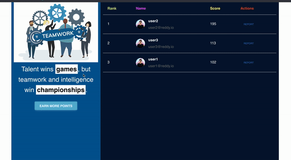

# Reddy Onboarding Assessment

## What have I done

As I understood from the description of the task, It was more focused on UI/UX than the backend
so I have tried to create a simple leaderboard UI with `React JS`.



## The backend
In this project, I have just exposed a simple `GET` endpoint from the backend which will return all the
user activity logs. The API will be consumed by the frontend and ranks will be calculated on the UI itself.
We might need to paginate this API in the future when number of users are increased. In that case, the leaderboard
calculations will also need to happen on the backend

## The frontend
The frontend is a SPA which renders the leaderboard based on the scores that are assigned to the users. It's
built with `React JS` and `MDBBootstrap` library.

## How to run
_**Run backend service**_
- Install following dependencies: `Django`, `djangorestframework`, and `django-cors-headers` 
- Run migrations once by running following 2 commands:
  ```bash
  python3 manage.py makemigrations
  python3 manage.py migrate
  ```
- Start the backend by running following command in the root directory: `python3 manage.py runserver`

_**Run frontend service**_
- Navigate to frontend folder and install dependencies
  ```bash
    cd frontend
    npm install
  ```
- Start the frontend by running following command in `frontend` directory:
  ```bash
    npm start
  ```

## What's not covered
I have not done user authentication and not allowed users to complete more activities to increase their score